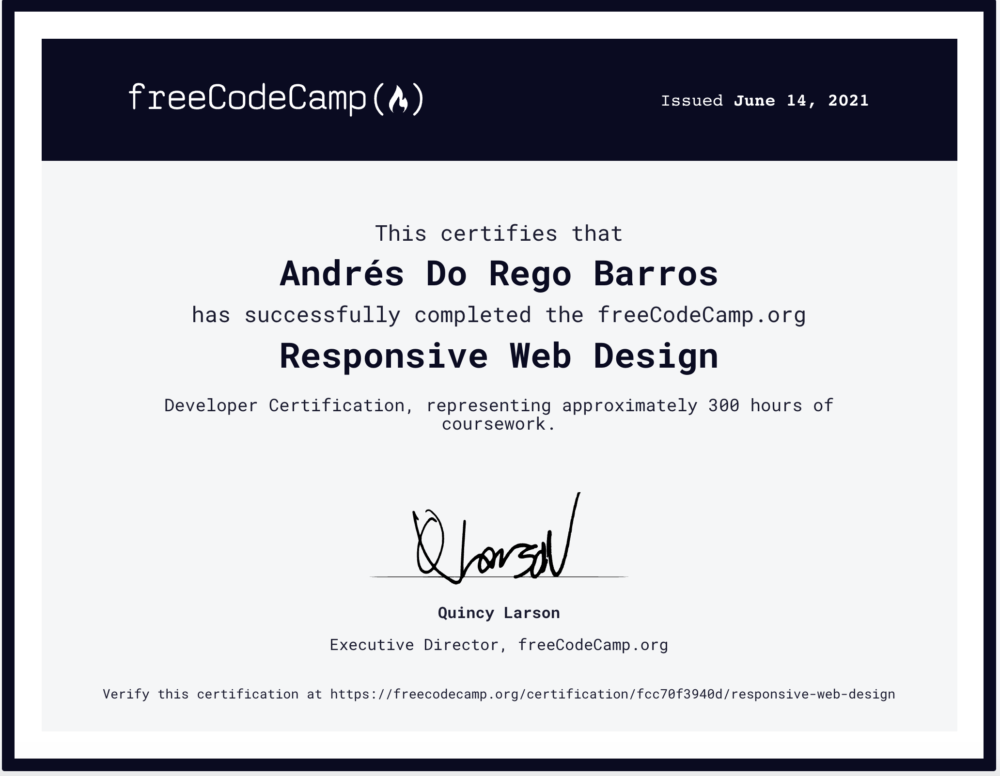
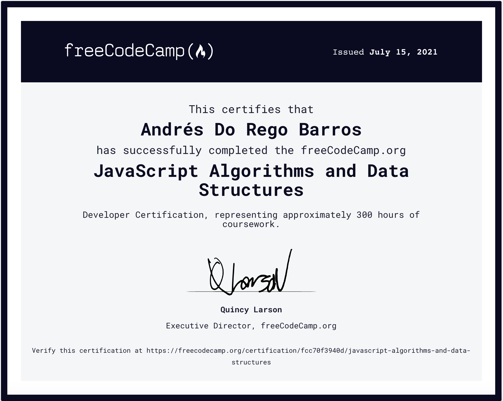

<!DOCTYPE html>
<html lang="en">

<head>
    <meta charset="UTF-8">
    <meta http-equiv="X-UA-Compatible" content="IE=edge">
    <meta name="viewport" content="width=device-width, initial-scale=1.0">
    <meta property="og:url"                content="https://adorego.github.io/landing/" />
    <meta property="og:type"               content="website" />
    <meta property="og:title"              content="Andres Do Rego Barros, Typescript/Javascript Software Engineer" />
    <meta property="og:description"        content="Developer of Typescript/Javascript Web Software with React & Angular Projects experience and Innovation Background " />
    <meta property="og:image"              content="https://adorego.github.io/landing/images/social_media_image.jpeg" />
    <link 
        href="https://cdn.jsdelivr.net/npm/bootstrap@5.0.2/dist/css/bootstrap.min.css" 
        rel="stylesheet" 
        integrity="sha384-EVSTQN3/azprG1Anm3QDgpJLIm9Nao0Yz1ztcQTwFspd3yD65VohhpuuCOmLASjC" 
        crossorigin="anonymous">
    <link rel="stylesheet" href="https://cdn.jsdelivr.net/npm/bootstrap-icons@1.3.0/font/bootstrap-icons.css">
    <link rel="stylesheet" type="text/css" href="https://fonts.googleapis.com/css?family=Open+Sans" />

    <link rel="stylesheet" href="style.css">
    <title>Andrés Do Rego Barros, Typescript/Javascript Software Engineer, React & Angular</title>
    <!-- Global site tag (gtag.js) - Google Analytics -->
    
    

</head>
<body>
    <nav class="navbar navbar-dark navbar-expand-lg fixed-top">
        

            <button class="navbar-toggler" type="button" data-bs-toggle="collapse" data-bs-target="#navbarContent"
                aria-controls="navbarContent" aria-expanded="false" aria-label="Toggle navigation">
                
            </button>
            

                <ul class="navbar-nav mx-auto mb-2 mb-lg-0">
                  <li class="nav-item">
                        <a class="nav-link" aria-current="page" href="#profile">Profile</a>
                  </li> 
                  <li class="nav-item">
                    <a class="nav-link active" aria-current="page" href="#innovationProjects">Innovation Projects</a>
                  </li>
                  <li class="nav-item">
                    <a class="nav-link" aria-current="page" href="#experience">Experience</a>
                  </li>
                  
                  <li>
                    <a class="nav-link" aria-current="page" href="#certifications">Certifications</a>
                  </li>
                  <li>
                    <a class="nav-link" aria-current="page" href="#contact">Contact</a>
                  </li>

                </ul>
            

        

    </nav>
    <section id="main">
        

            
            <h2>Andrés Do Rego Barros</h2>
            <h3>Javascript/Typescript FullStack Software Engineer</h3>
            <h4>Real Experience with Angular 11.0 and React 17.0</h4>
            <h4>Node, Express and Mongodb</h4>
            <a href="https://wa.me/595981365300" target="_blank" role="button" class="btn btn-danger">Contact Me</a>
        

    </section>
    <section id="profile">
        

            

                

                    <fieldset>
                        <legend>Profile</legend>
                        
I’m a hands-on Engineer with deep knowledge on:
                            <ul>
                            <li>React and Angular as Front-End Library and Framework.</li> 
                            <li>Node, Express and MongoDB as Back-End Framework.</li> 
                            <li>TDD, BDD as Software Development Methodology.</li> 
                            <li>Agile as Project Management Method.</li> 
                            <li>Architecture best practices and clean code as coding standards.</li> 
                            </ul>
                        

                    </fieldset>
                

                

                    <fieldset>
                        <legend>Education</legend>
                        <ul>
                        <li>1995-2001 Bachelor of Science in Computer Electronics and Telecommunications. 
                            Catholic University of Asunción-Paraguay. 
                        </li>

                        <li>2002-2004 Electronics and Software Engineer Degree (
                            <a href="https://www.linuxjournal.com/article/7258" target="_blank">Final Work: Building Automation Platform</a>).  
                            Catholic University of Asunción-Paraguay 
                        </li>
                        <li>January 2008-July 2009 Master in Business Administration. 
                            Polytechnic University of Madrid-Spain  
                        </li>
                        </ul>   
                    </fieldset>
                

                

                    <fieldset>
                        <legend>Languages</legend>
                        <ul>
                           <li> English (Advanced Level)</li>   
                            <li>German (Advanced Level)</li>
                            <li>Portuguese (Mother Tongue)</li>
                            <li>Spanish (Mother Tongue)</li>
                        </ul>
                    </fieldset>
                

            

        

    </section>
    <section id="innovationProjects">
        

            <h3>Innovation Projects</h3>
            

                

                    

                        

                            <h4 class="card-title">LoyaltyAPP</h4>
                            

                                <h5 class="card_subtitle">Tech Stack</h5>
                                <button class="pills btn btn-default">React 17.0.2</button>
                                <button class="pills btn btn-default">React Hooks</button>
                                <button class="pills btn btn-default">Redux</button>
                                <button class="pills btn btn-default">Node 12.16.1</button>
                                <button class="pills btn btn-default">Express 4.17.1</button>
                                <button class="pills btn btn-default">Mongoose 6.0.5</button>
                                <button class="pills btn btn-default">Mongodb 4.2.3</button>
                            

                            <h5 class="card_subtitle">Methodology</h5>
                                <h6 >Agile-Rapid Prototyping</h6>
                            <h5 class="card_subtitle">Description</h5>
                                
LoyaltyAPP is a solution for a Finance Company. The scope is to create a tool for Customer able
                                    to share offers within his Friends and get rewarded for this shares

                            <h5 class="card_subtitle">Repositories</h5>
                                <a href="https://github.com/adorego/LoyaltyAPP-client/tree/master" target="_blank">Client Repo</a>
                                <a href="https://github.com/adorego/LoyaltyApp-backend" target="_blank">Server Repo</a>    
                                
                        

                    

                

                

                    

                        

                            <h4 class="card-title">MenuDigital</h4>
                            

                                <h5 class="card_subtitle">Tech Stack</h5>
                                <button class="pills btn btn-default">Angular 11.1.1</button>
                                <button class="pills btn btn-default">Angular Flex-Layout 11.0.0</button>
                                <button class="pills btn btn-default">Rxjs 6.6.0</button>
                                <button class="pills btn btn-default">Node 12.16.1</button>
                                <button class="pills btn btn-default">Express 4.16.1</button>
                                <button class="pills btn btn-default">Mongoose 5.12.3</button>
                                <button class="pills btn btn-default">Mongodb 4.2.3</button>
                            

                            <h5 class="card_subtitle">Methodology</h5>
                                <h6 >Agile-Rapid Prototyping</h6>
                            <h5 class="card_subtitle">Description</h5>
                                
MenuDigital is a SaaS Service for the Gastronomy Industry, it is a tool to dynamically create a Digital Menu

                            <h5 class="card_subtitle">Repositories</h5>
                                <a href="https://github.com/adorego/menudigital" target="_blank">Project Repo</a>    
                        

                    

                

                

                    

                        

                            <h4 class="card-title">SmartPY</h4>
                            

                                <h5 class="card_subtitle">Tech Stack</h5>
                                <button class="pills btn btn-default">React 17.0.2</button>
                                <button class="pills btn btn-default">React Hooks</button>
                                <button class="pills btn btn-default">Redux</button>
                                <button class="pills btn btn-default">Node 12.16.1</button>
                                <button class="pills btn btn-default">Express 4.17.1</button>
                                <button class="pills btn btn-default">Mongoose 6.0.5</button>
                                <button class="pills btn btn-default">Mongodb 4.2.3</button>
                            

                            <h5 class="card_subtitle">Methodology</h5>
                                <h6 >Agile-Rapid Prototyping-TDD</h6>
                            <h5 class="card_subtitle">Description</h5>
                            
A Smartphone e-commmerce Project

                            <h5 class="card_subtitle">Repositories</h5>
                                <a href="https://github.com/adorego/smartPY/tree/master" target="_blank">Client Repo</a>    

                            
                        

                    

                

            

        

    </section>
    <section id="experience">
        

            <h4>More than 15 years of experience leading and developing Innovation Projects</h4>
            <ul>
                <li>(2017-Today) Tech Lead Consultant</li>
                
As a Tech Lead I'm responsible of leading a Software development Team. 

                
We have developed an e-commerce platform for a Financial Company:<a href="https://www.yasui.com.py" target="_blank">E-Commerce link</a>

                
A Travel Web Portal Solution:<a href="https://www.nosvamoos.com" target="_blank">Travel Portal</a>

                
Segmented Marketing Solutions

                <li>(2017-Today) Software Engineer Consultant</li>
                
As a Software Engineer Consultant I have Clients from different Industries for whom I develop Web Software Solutions

                
I've developed solutions for Car Tracking, Building Automation and Marketing Campaigns and currently working on projects
                    outlined in: <a href="#innovationProjects">Innovation Projects</a>
                

                <li>(2012-2017) Head of Product - APVAS(<a href="http://apvas.com" target="_blank">APVAS Telecom Value Added Service Provider</a>) - Miami Florida</li>
                

                    As a Head of Product I defined, specified and rolled-out the Company products/services in three countries (USA, El Salvador, Haiti) 
                

                <h3>In Millicom I've been awarded with 2010 Innovation Group Award in Stockholm-Sweden</h3>
                <li>(2010-2012) Africa Reginal Product/ Program Manager - MIC Millicom International(<a href="https://millicom.com" target="_blank">Millicom</a>)</li>
                
Based in Ghana-Africa, I was responsible for the Program/Product Management of 7 Countries

                <li>(2008-2010) Global Product/ Program Manager- MIC Millicom International(<a href="https://millicom.com" target="_blank">Millicom</a>)</li>
                
Based in El Salvador-Central America, I was responsible for the Program/Product Management of 14 Countries

                <li>(2007-2008) Paraguay Product Manager - Tigo(<a href="https://tigo.com.py" target="_blank">Tigo Paraguay</a>)</li>
                
As Product Manager I created and successfully launched more than 7 services/products for the Paraguayan Market, I've been 
                    recognized for their financial results 

                

                <li>(2003-2007) IT Manager at Conacyt Paraguay(<a href="https://www.conacyt.gov.py" target="_blank">Conacyt</a>) </li>
                
As IT Manager I was responsible of Institution TIC Infrastructure

            </ul>
        

 
    </section>
    <section id="certifications">
        

            <h4>Certifications</h4>
            

                

                    

                        
                        

                            <h4 class="card-title">Responsive Web Design (300 hours)</h4>
                        

                    

                

                
                

                    

                        
                        

                            <h4 class="card-title">Javascript Algorithms and Data Structure (300 hours)</h4>
                        

                    

                    
                

                

                    

                        
                        

                            <h4 class="card-title">Front End Development Libraries (300 hours)</h4>
                        

                    

                    
                

            

        

    </section>
    <section id="contact">
        <h4>Contact</h4>
        <a href="https://wa.me/595981365300" target="_blank"><i class="bi bi-telephone"></i>+595 981 365 300</a>
        <a href="mailto:adoregoel@gmail.com"><i class="bi bi-envelope"></i>Email Me</a>
    </section>
    
    
    
</body>
</html>